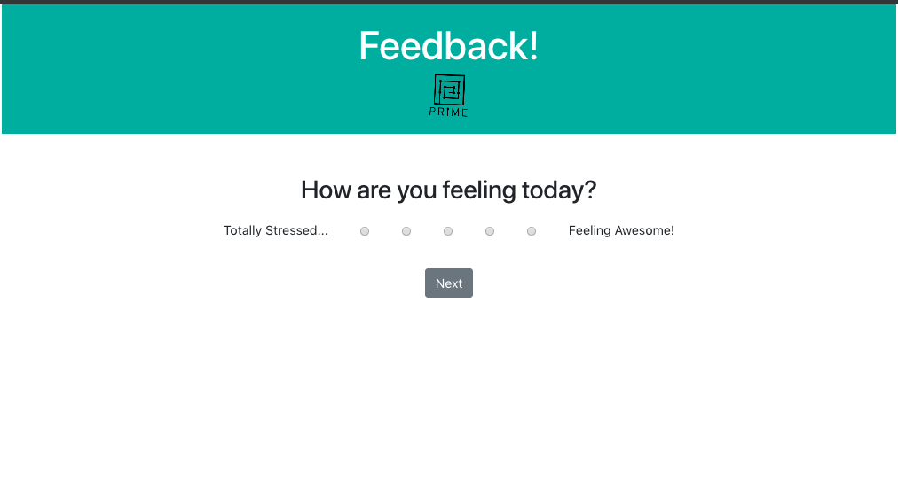
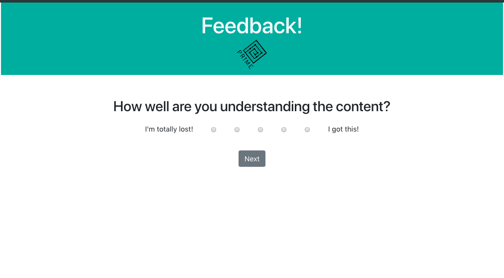
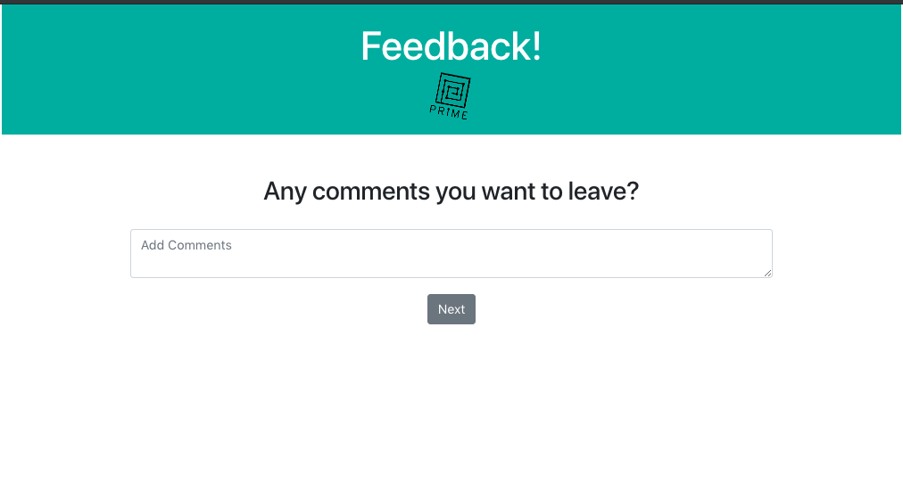
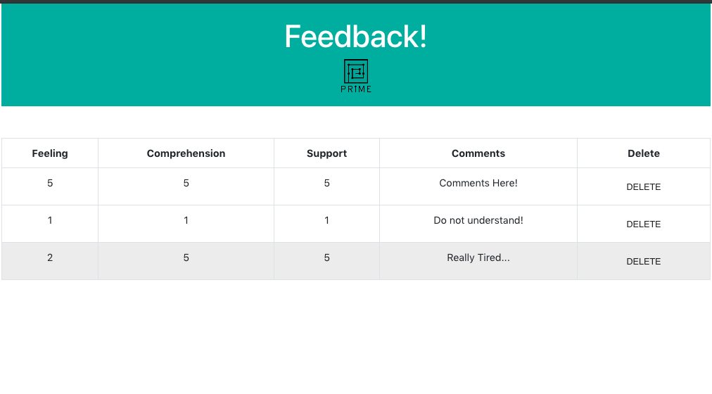

# Prime Feedback 
This project collects feedbacks from student in four different views.  Each will assess on a scale of 1-5 how well the student feels after the day was over, how well they understood the content, if they were supported by the Prime staff, and finally if they wish to add any additional comments.

## Built With
* ReactJS
* Redux
* JavaScript
* Node
* Express
* PostreSQL
* Bootstrap

## Getting Started

### Prerequisites
Before you get started, make sure you have the following software installed on your computer:

- Download this project
- [Node.js](https://nodejs.org/en/)
- [PostrgeSQL](https://www.postgresql.org/)
- [Nodemon](https://nodemon.io/)

### Create Database and Table
Create a new database called `prime_feedback` and create a `feedback` table:

```SQL
CREATE TABLE "feedback" (
    "id" serial primary key,
    "feeling" INT not null,
    "understanding" INT not null,
    "support" INT not null,
    "comments" text,
    "flagged" boolean default false,
    "date" date not null default CURRENT_DATE
); 
```

### Installing
* Start postgres if not running already by using `brew services start postgresql`
* Run `npm run server`
* Run `npm run client`
* Navigate to `localhost:3000`

### Screen Shots






## Completed Features
- [x] Feeling Feature
- [x] Understanding Feature
- [x] Support Feature
- [x] Comment Feature
- [x] Admin Feature (In order to view this feature, you must change the URL to /admin)

## Next Steps
- [ ] Add Login and Register Feature
- [ ] Add more styling with Material UI
- [ ] Deploy on Heroku

### Author
* Phi Tran
